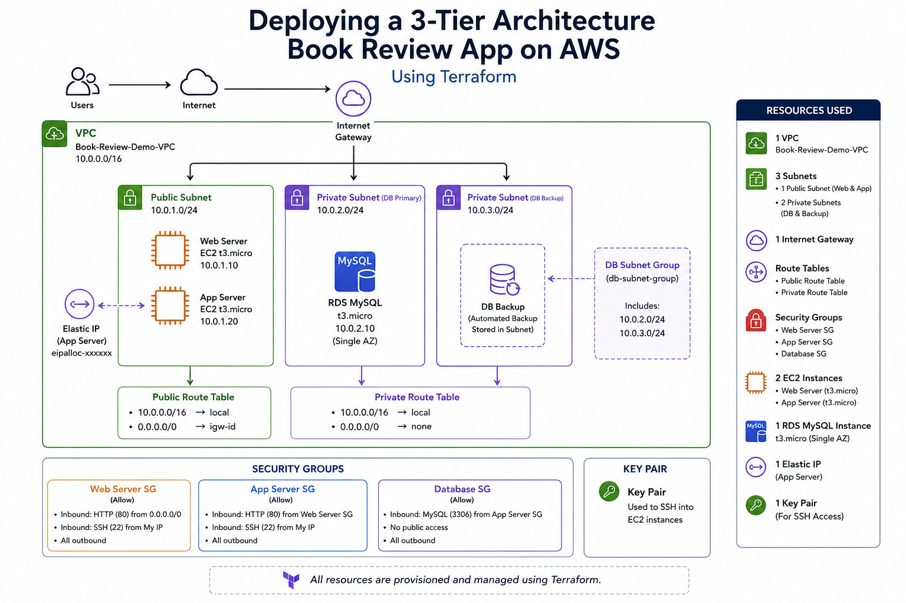

# 3-Tier Web App Deployment on AWS Using Terraform

This project demonstrates the deployment of a scalable and secure **3-tier web application architecture on AWS using Infrastructure as Code (IaC) with Terraform**.

I recently deployed this system end-to-end and simulated a production-style environment using real EC2 configuration, networking design, and runtime process management.

The architecture follows a clean separation of concerns between the presentation, application, and database layers to improve scalability, maintainability, and operational reliability.

---

## Architecture Diagram

 

---
## Architecture Overview

The environment is deployed within a custom **Amazon VPC** using public and private subnets to enforce network segmentation and security isolation.

### Presentation Layer
- Hosted on Amazon EC2
- Serves the frontend web application
- Handles user interaction via browser (HTTP requests)
- Publicly accessible via EC2 public IP

### Application Layer
- Hosted on Amazon EC2
- Processes business logic and API requests
- Connects securely to the database layer
- Runs as a managed process using **PM2** for production-like reliability

### Data Layer
- Amazon RDS MySQL database
- Stores user accounts, book data, and reviews
- Fully isolated in private subnets (no public access)

---

## Infrastructure Design (AWS)

- Custom VPC (network isolation)
- Public subnet (frontend + controlled access layer)
- Private subnets (database isolation)
- Internet Gateway for external access
- Route tables for traffic control
- Security Groups enforcing tier-to-tier communication rules
- EC2 instances for frontend and backend services
- Amazon RDS (MySQL) for persistent storage
- Elastic IP for stable backend/public access during testing

---

## Technologies Used

- Terraform (Infrastructure as Code)
- AWS EC2
- Amazon RDS (MySQL)
- Amazon VPC
- Public & Private Subnets
- Security Groups
- IAM
- Route Tables
- Internet Gateway
- Linux (Amazon Linux 2)
- Node.js
- PM2 Process Manager
- HTML / CSS / JavaScript

---

## Key Features

- Full infrastructure provisioning using Terraform
- Secure 3-tier cloud architecture design
- Network segmentation using public/private subnets
- Least privilege security group configuration
- Backend-to-database secure communication
- Production-style process management using PM2
- End-to-end frontend + backend deployment
- API-driven communication between layers
- Real-world cloud troubleshooting and debugging experience

---

## Deployment & Operations Highlights

- Manually configured EC2 instances (Node.js runtime setup, dependencies, environment variables)
- Connected backend services to Amazon RDS MySQL
- Built and deployed frontend application with API integration
- Used **PM2** to keep services running after SSH disconnect (production simulation)
- Debugged Next.js production issue caused by missing `.next` build (resolved via `npm run build`)
- Troubleshot API failures caused by AWS Security Group misconfiguration using Chrome DevTools and `curl`

---

## Goals of This Project

This project was built to strengthen hands-on experience with:

- Cloud infrastructure engineering
- AWS architecture design (VPC, subnets, routing)
- Infrastructure as Code (Terraform)
- Networking and security in distributed systems
- Linux server administration
- DevOps-style deployment workflows
- Production-like application operations

---

## Security Considerations

- Database is fully isolated in private subnets
- No public access to RDS
- Security Groups restrict communication between tiers
- SSH access should be limited to trusted IPs only
- Only required application ports exposed publicly

---

## Future Improvements

- Load balancing and Auto Scaling Groups
- CI/CD pipeline integration (GitHub Actions / CodePipeline)
- Docker containerization for services
- Centralized logging and monitoring (CloudWatch)
- HTTPS setup with ACM certificates
- AWS WAF integration for security hardening
- Modular Terraform refactoring for scalability
